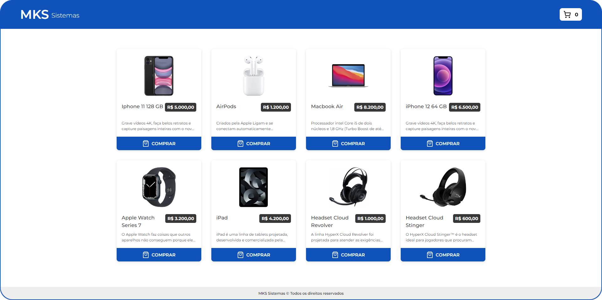
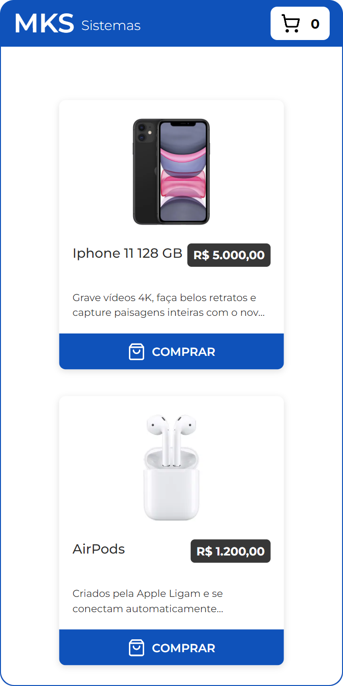

<br>

<p align="center"></p>

<h1 align="center">Desafio: MKS Sistemas</h1>

<br>

<p align="center"></p>

<br>

<p align="center"><a href="https://mkssistemas.bohr.io/">Link do Deploy</a></p>

<br>


> Entrega do desafio proposto pela MKS desenvolvimento de sistemas como parte do processo seletivo para vaga de desenvolvedor Junior.

<br>

## Apresentação:

Para mais detalhes sobre o desafio da avaliação [**clique aqui**](./readme/desafio.md).

<br>

## Sobre o Projeto:

A ideia deste desafio é desenvolver uma tela de um E-commerce como parte do processo seletivo para vaga de desenvolvedor Junior da MKS, a aplicação é totalmente baseada no seguinte [**Figma**](https://www.figma.com/file/ay9JKCd6LKvKLE7TclJJkX/MKS-Front-end-challenge?type=design&node-id=0%3A1&mode=design&t=AlZMI9zkOlhrx6JF-1).

<br>

## Ferramentas Utilizadas:

```
    - Vite
    - TypeScript
    - React
    - React-query
    - Styled-components
    - React-router-dom
    - Axios
    - Lucide-react
    - Sonner
```

<br>

## Como usar:

```bash
    # Clone este repositório
    $ git clone https://github.com/Natangaf/Desafio-MKS_Sistemas

    # Acesse a pasta do projeto no seu terminal/cmd
    $ cd MKS-Test

    # Instale as dependências
    $ npm i

    # Execute a aplicação em modo de desenvolvimento
    $ npm run dev

    # A aplicação será aberta na porta:5173 - acesse http://localhost:5173
```

<p align="center"><small>ou acesse o deploy da aplicação para conferir a mesma online.</small></p>

<br>

## Imagens do Projeto:

<br>

#### 01. Desktop:
<p align="center"></p>
<p align="center"><small>Imagem da versão Desktop do site.</small></p>

#### 02. Mobile:
<p align="center"></p>
<p align="center"><small>Imagem da versão mobile do site.</small></p>

<br>

## Links e Referências:

- **Link do projeto:** [Link do Deploy](https://bohr.io/Natangaf/Desafio-MKS_Sistemas)
- **Documentação do desafio:** [Documentação Desafio](./readme/desafio.md)
- **Figma do projeto:** [Link Figma](https://www.figma.com/file/ay9JKCd6LKvKLE7TclJJkX/MKS-Front-end-challenge?type=design&node-id=0%3A1&mode=design&t=AlZMI9zkOlhrx6JF-1)
- **API do projeto:** [Link API](https://mks-frontend-challenge-04811e8151e6.herokuapp.com/api-docs/)